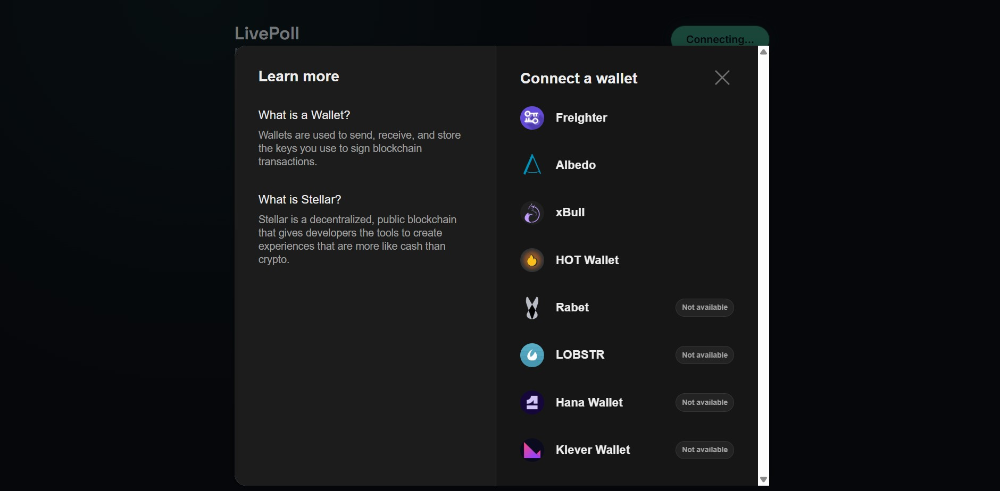

<!-- # LivePoll

A one-question live poll dApp for the Rise Stellar Hackathon — Level 2 (Yellow Belt).

Connect any supported wallet (Freighter, xBull, Albedo, and others via StellarWalletsKit), vote once on a poll backed by a Soroban smart contract, and watch results update in near real time as votes land on testnet — no page refresh required.

## How it meets the Level 2 requirements

| Requirement | Where |
|---|---|
| StellarWalletsKit implementation | `lib/wallet-kit.ts`, `components/WalletConnectMulti.tsx` |
| 3 error types handled | `lib/errors.ts` classifies wallet-not-found, user-rejected, and insufficient-balance errors; surfaced via `components/ErrorBanner.tsx` |
| Contract deployed on testnet | `contracts/poll` (Soroban Rust contract) — deploy steps below |
| Contract called from the frontend | `lib/soroban.ts` (`get_question`, `get_options`, `get_results`, `has_voted`, `vote`) |
| Reading and writing data to a contract | Reads: `simulateRead`. Writes: `callContractWrite` (simulate → sign → submit → poll for status) |
| Event listening and state synchronization | `lib/events.ts` polls Soroban RPC `getEvents` for `vote` events and folds them into the live results and activity feed |
| Transaction status visible | `components/TransactionStatus.tsx` — simulating → signing → submitting → success/error, with tx hash and explorer link |

## Tech stack

- **Contract:** Rust + `soroban-sdk` 22, compiled to Wasm
- **Frontend:** Next.js 14 (App Router) + TypeScript + Tailwind CSS
- **Wallets:** [`@creit.tech/stellar-wallets-kit`](https://github.com/Creit-Tech/Stellar-Wallets-Kit) — multi-wallet picker (Freighter, xBull, Albedo, Rabet, WalletConnect, ...)
- **Chain access:** [`@stellar/stellar-sdk`](https://www.npmjs.com/package/@stellar/stellar-sdk) `rpc.Server` for simulate / submit / getEvents against Soroban RPC testnet

## Project structure

```
livepoll/
├── contracts/poll/       # Soroban contract (Rust)
│   └── src/lib.rs
├── app/                  # Next.js pages, layout, global styles
├── components/           # WalletConnectMulti, PollCard, ResultsLive, ActivityFeed,
│                          # TransactionStatus, ErrorBanner
├── lib/                  # wallet-kit.ts, soroban.ts, events.ts, errors.ts
├── types/                # Shared TypeScript types
```

## Prerequisites

- Node.js 18+
- [Rust](https://www.rust-lang.org/tools/install) + the `wasm32v1-none` (or `wasm32-unknown-unknown`) target
- [Stellar CLI](https://developers.stellar.org/docs/tools/cli/install-cli) (`stellar` command — formerly `soroban-cli`)
- A wallet extension set to **testnet**: [Freighter](https://freighter.app), [xBull](https://xbull.app), or [Albedo](https://albedo.link)

## 1. Deploy the contract

```bash
# From the repo root

# Add the wasm target if you haven't already
rustup target add wasm32v1-none

# Create (or reuse) a CLI identity and fund it on testnet
stellar keys generate deployer --network testnet --fund

# Build the contract
stellar contract build

# Deploy — prints the contract ID, save it
stellar contract deploy \
  --wasm target/wasm32v1-none/release/poll_contract.wasm \
  --source deployer \
  --network testnet
```

Then initialize the poll with your question and options (replace `CONTRACT_ID`):

```bash
stellar contract invoke \
  --id CONTRACT_ID \
  --source deployer \
  --network testnet \
  -- initialize \
  --admin $(stellar keys address deployer) \
  --question "Best Stellar wallet?" \
  --options '["Freighter","xBull","Albedo"]'
```

## 2. Configure the frontend

```bash
cp .env.example .env.local
```

Set `NEXT_PUBLIC_POLL_CONTRACT_ID` in `.env.local` to the contract ID from the deploy step.

## 3. Run locally

```bash
npm install
npm run dev
# http://localhost:3000
```

## How to use

1. Click **Connect Wallet** and pick Freighter, xBull, or another supported wallet from the picker.
2. The poll question and current results load straight from the contract.
3. Click an option to vote. Approve the signature request in your wallet — the transaction card tracks simulating → signing → submitting → success/error.
4. Once confirmed, the results bars and activity feed update — both for your own vote and for anyone else voting concurrently, since the app polls Soroban RPC for new `vote` events every few seconds.

## Error handling

`lib/errors.ts` classifies failures from wallet SDKs and Soroban RPC into distinct, user-facing categories:

- **Wallet not found** — no compatible extension detected
- **Request rejected** — the user declined the connection or signature request in their wallet
- **Insufficient balance** — the account can't cover the transaction fee
- **Contract error** — e.g. voting twice, or an invalid option index, mapped from the contract's `Error` enum
- **Unknown** — anything else, shown with the raw message for debugging

## Contract tests

```bash
cd contracts/poll
cargo test
```

Covers: initialize + vote happy path, rejecting a double vote, rejecting an invalid option index, and rejecting a second `initialize` call.

## Notes

- This app only talks to **Stellar Testnet** / **Soroban RPC testnet** — no mainnet funds are ever at risk.
- Soroban RPC's event retention window is rolling (a few days on testnet), which is more than enough for a live demo but not a permanent event log. -->


# LivePoll

A one-question live poll dApp for the Rise Stellar Hackathon — Level 2 (Yellow Belt).

Connect any supported wallet (Freighter, xBull, Albedo, and others via StellarWalletsKit), vote once on a poll backed by a Soroban smart contract, and watch results update in near real time as votes land on testnet — no page refresh required.

## How it meets the Level 2 requirements

| Requirement | Where |
|---|---|
| StellarWalletsKit implementation | `lib/wallet-kit.ts`, `components/WalletConnectMulti.tsx` |
| 3 error types handled | `lib/errors.ts` classifies wallet-not-found, user-rejected, and insufficient-balance errors; surfaced via `components/ErrorBanner.tsx` |
| Contract deployed on testnet | Soroban Rust contract deployed on Stellar Testnet |
| Contract called from the frontend | `lib/soroban.ts` (`get_question`, `get_options`, `get_results`, `has_voted`, `vote`) |
| Reading and writing data to a contract | Reads: `simulateRead`. Writes: `callContractWrite` (simulate → sign → submit → poll for status) |
| Event listening and state synchronization | `lib/events.ts` polls Soroban RPC `getEvents` for `vote` events and folds them into the live results and activity feed |
| Transaction status visible | `components/TransactionStatus.tsx` — simulating → signing → submitting → success/error, with tx hash and explorer link |

## Tech Stack

- **Contract:** Rust + `soroban-sdk` 22, compiled to Wasm
- **Frontend:** Next.js 14 (App Router) + TypeScript + Tailwind CSS
- **Wallets:** StellarWalletsKit — Freighter, xBull, Albedo, Rabet, WalletConnect
- **Chain access:** `@stellar/stellar-sdk` RPC server for simulate / submit / getEvents against Soroban RPC testnet

## Project Structure

```
livepoll/
├── contracts/poll/       # Soroban contract (Rust)
│   └── src/lib.rs
├── app/                  # Next.js pages, layout, global styles
├── components/           # WalletConnectMulti, PollCard, ResultsLive, ActivityFeed,
│                          TransactionStatus, ErrorBanner
├── lib/                  # wallet-kit.ts, soroban.ts, events.ts, errors.ts
├── types/                # Shared TypeScript types
```

## Prerequisites

- Node.js 18+
- Rust + the `wasm32v1-none` target
- Stellar CLI (`stellar` command)
- A wallet extension set to **testnet**:
  - Freighter
  - xBull
  - Albedo

---

# Setup Instructions

## 1. Deploy the Contract

From the repo root:

```bash
rustup target add wasm32v1-none

stellar keys generate deployer --network testnet --fund

stellar contract build

stellar contract deploy \
  --wasm target/wasm32v1-none/release/poll_contract.wasm \
  --source deployer \
  --network testnet
```

Initialize the poll:

```bash
stellar contract invoke \
  --id CONTRACT_ID \
  --source deployer \
  --network testnet \
  -- initialize \
  --admin DEPLOYER_ADDRESS \
  --question "Best Stellar wallet?" \
  --options '["Freighter","xBull","Albedo"]'
```

---

## 2. Configure the Frontend

Create your environment file:

```bash
cp .env.example .env.local
```

Add your deployed contract ID:

```env
NEXT_PUBLIC_POLL_CONTRACT_ID=CCCUXZQQ4FGUXE6UCPFX4DWFLNUGHQUK5XZVMDSJEP34KY2INQPD3G7S
```

---

## 3. Run Locally

Install dependencies:

```bash
npm install
```

Start the application:

```bash
npm run dev
```

Open:

```
http://localhost:3000
```

---

# How to Use

1. Click **Connect Wallet** and select a supported Stellar wallet.
2. The poll question and results load from the Soroban smart contract.
3. Select an option and submit your vote.
4. Approve the transaction in your wallet.
5. View transaction status from submission to confirmation.
6. Results and activity feed update automatically through contract events.

---

# Error Handling

The application handles:

### Wallet Not Found
No compatible wallet extension is detected.

### Request Rejected
The user rejects wallet connection or transaction signing.

### Insufficient Balance
The wallet does not have enough XLM to cover transaction fees.

### Contract Errors
Examples:
- Voting twice
- Invalid option selection

---

# Screenshots

## Wallet Options Available

StellarWalletsKit provides a multi-wallet selection experience supporting:

- Freighter
- xBull
- Albedo
- Rabet
- etc.



---

# Deployment Details


---

## Deployed Smart Contract

Network:

```
Stellar Testnet
```

Contract Address:

```
CCCUXZQQ4FGUXE6UCPFX4DWFLNUGHQUK5XZVMDSJEP34KY2INQPD3G7S
```

---

## Transaction Proof

A successful contract call can be verified on Stellar Explorer.

Transaction Hash:

```
 7e6f493563fe329de113f031489d4818a36a11434f736ba7e658b00c4c7c7f0a
```

Explorer:


```
https://stellar.expert/explorer/testnet/tx/7e6f493563fe329de113f031489d4818a36a11434f736ba7e658b00c4c7c7f0a
```

---

# Contract Tests

Run:

```bash
cd contracts/poll
cargo test
```

Tests cover:

- Contract initialization
- Successful voting
- Preventing duplicate votes
- Invalid option handling
- Preventing multiple initialization attempts

---

# Notes

- This application only interacts with Stellar Testnet.
- No real funds are used.
- Vote events are monitored through Soroban RPC and synchronized with the frontend in near real time.